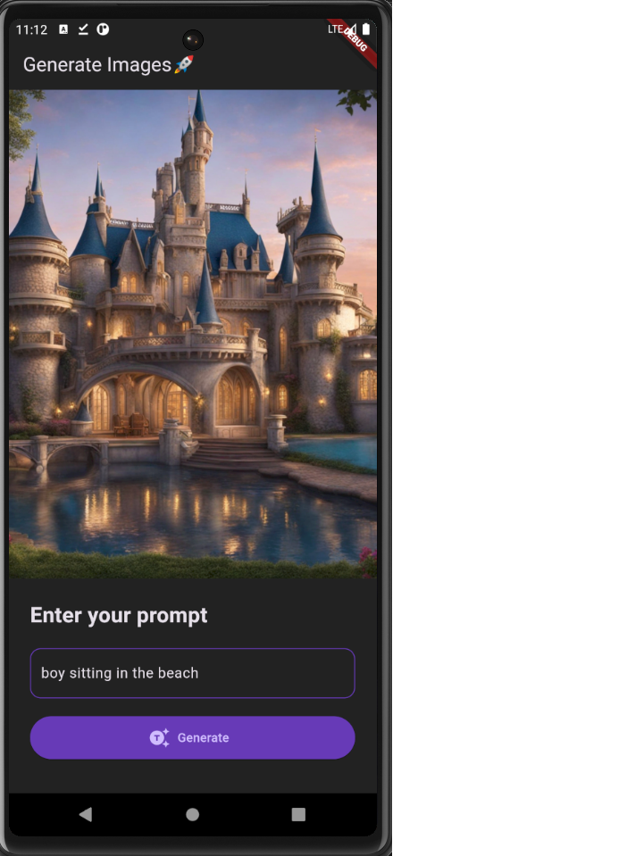
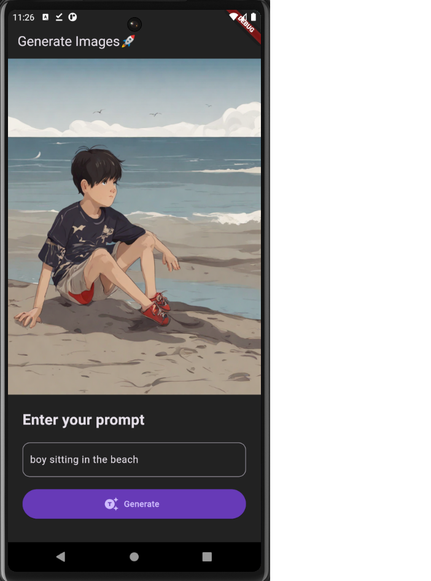

# Image Generation Flutter Application

A Flutter-based mobile application that leverages the Imagine AI API to generate high-quality images. This project demonstrates the integration of AI-powered image generation within a mobile app, offering users an intuitive and seamless experience.

## Features

- **AI Image Generation**: Create custom images using the Imagine AI API.
- **User-Friendly Interface**: Simple and intuitive UI built with Flutter.
- **Performance Optimization**: Efficient API handling and image rendering.
- **Cross-Platform Compatibility**: Runs smoothly on both Android and iOS.

## Screenshots

### Prompt Input


### Generated Image


## Getting Started

### Prerequisites

- **Flutter**: Ensure you have Flutter installed. [Get Flutter](https://flutter.dev/docs/get-started/install)
- **Imagine AI API Key**: Sign up for an API key from Imagine AI.

### Installation

1. Clone the repository:
   ```bash
   git clone https://github.com/yourusername/image-generation-flutter-app.git
   ```
2. Navigate to the project directory:
   ```bash
   cd image-generation-flutter-app
   ```
3. Install dependencies:
   ```bash
   flutter pub get
   ```
4. Set up your Imagine AI API key in the project:
   - Open the `lib/feature/prompt/repos/prompt_repo.dart` file.
   - Locate the `headers` map and replace the placeholder with your Imagine AI API key:
     ```dart
     Map<String, dynamic> headers = {
       'Authorization': 'Bearer YOUR_API_KEY_HERE'
     };
     ```

### Running the Application

1. Start the app on your preferred device or emulator:
   ```bash
   flutter run
   ```
2. Explore the app and generate images using the Imagine AI API.

## Usage

1. Open the app and navigate to the image generation screen.
2. Enter the desired parameters for image generation.
3. Click on "Generate" to create the image using the Imagine AI API.


## Built With

- [Flutter](https://flutter.dev/) - The UI toolkit for building natively compiled applications.
- [Imagine AI API](https://imagineai.com/) - The API for AI-powered image generation.

## Contributing

Contributions are welcome! Please fork this repository and submit a pull request.


